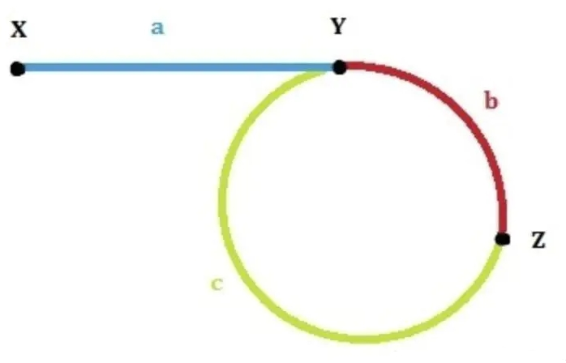

设：链表头是X，环的第一个节点是Y，slow和fast第一次的交点是Z。各段的长度分别是a,b,c，如图所示
第一次相遇时slow走过的距离：a+b，fast走过的距离：a+b+c+b
因为fast的速度是slow的两倍，所以fast走的距离是slow的两倍，有 2(a+b) = a+b+c+b，可以得到a=c（这个结论很重要！）
这时候，slow从X出发，fast从Z出发，以相同速度走，同时到达Y，Y就是环的入口，即第一个节点